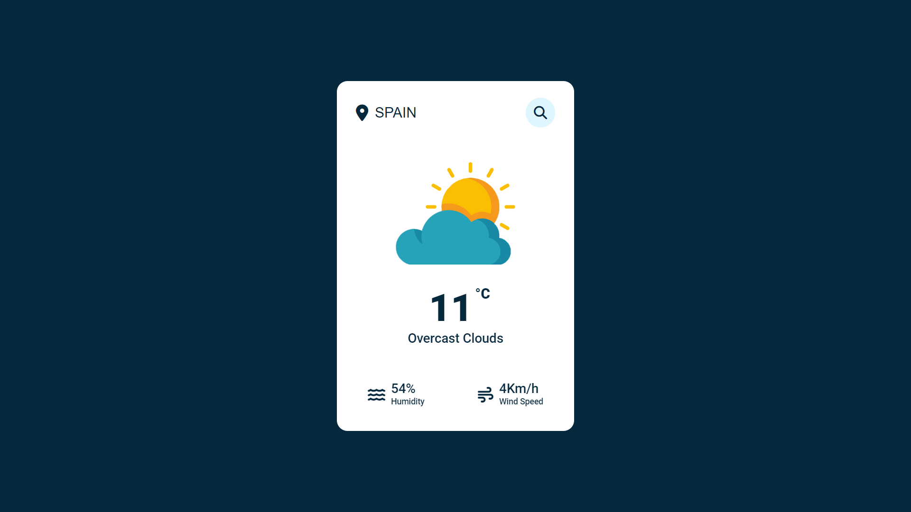

<h1 align="center">Weather-App</h1>

Weather-App, é um app de pesquisa de clima dos Países do mundo todo    

 

  

## 🚀 Tecnologias

Esse projeto foi desenvolvido com as seguintes tecnologias:

- HTML e CSS
- JavaScript
- Git e Github

## 💻 Projeto

O Weather-App é um app para ajudar pessoas a pesquisarem  climas do Mundo todo.

- [Visite o projeto online](https://maykbrito.github.io/nlw-setup)

